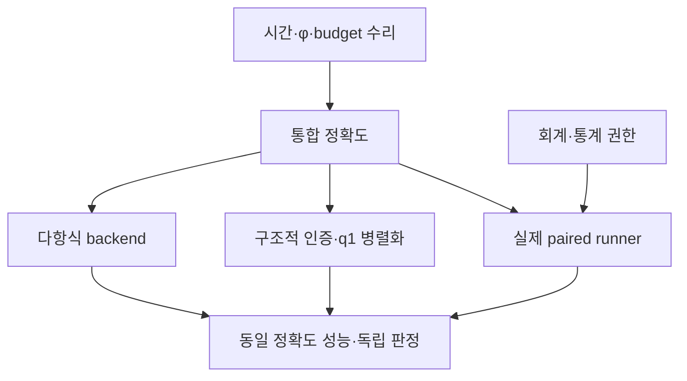

# VigilODE 업데이트 적대적 재감사와 후속 수학·코딩 연구

2026-09-30 · 2차 감사 · 기준 commit `7708ef90554fc3986478d4602de6a01c7266b14f`

## 1. 결론

**업데이트의 실질적인 개선을 인정한다. 그러나 일반 정확도·엄밀 인증·성능 우위에 대한 최종 판정은 여전히 REWORK / HOLD다.** 이전 φ 반례 세 종류, dense rejection 회계, malformed policy·norm 입력 검증, M08의 NaN 은폐, CLI의 median-only 승격을 현재 소스에서 다시 검사했다. 기존 반례가 해결된 것을 새로운 실패와 혼동하지 않았다.

이번에 확인한 잔여·신규 finding은 **7개: P1 1개, P2 6개**다. 가장 시급한 것은 출력·종료의 시간 원점 의존성이다. 표현 가능한 양의 구간에서도 적분을 한 번도 하지 않고 `success=true`를 반환하며, 별도 dense 경로에서는 아직 미래 출력 요청에 앞 endpoint 값을 붙인다. 유효한 budget 입력에서도 중간 overflow로 실제 예산 약 1이 10으로 바뀌는 사례를 확인했다. 나머지는 φ 가중치의 range 처리, dense oracle의 진폭 conditioning, 통계 session identity, work ledger의 Unknown 보존, 약화된 bootstrap 설정의 권한 문제다.

후속 연구는 계획에 그치지 않았다. 동일 24차 입력으로 Laguerre의 exp·φ₁…φ₄ 공동 action을 구현·검산했고, homotopy에는 앞 stage의 enclosure로 다음 stage의 비선형 오차 상계를 구성하는 방법을 실행했다. 비정규 문제에서는 성분별 구조를 보존한 상계가 스칼라 norm 상계의 과도한 보수성을 크게 줄였다. 다만 이 결과는 제한된 수학·prototype 근거이며 생산 인증이나 실제 wall-clock 가속을 입증하지 않는다.

권장 순서는 **시간·산술 계약 수리 → 회계·통계 권한 연결 → 통합 정확도 확인 → 다항식 backend와 구조적 homotopy 인증 병행 → 실제 병렬 성능 실험**이다. 구체적인 작업, 의존성, 산출물, acceptance와 실패 상태는 `NEXT_DEVELOPMENT_DAG.json`에 있다.

## 2. 감사 대상과 실행 권한

| 항목 | 고정값 / 해석 |
|---|---|
| Repository | `cosmosapjw-quantum/vigilode` |
| 최신 작업 브랜치 | `claude/jolly-wozniak-7wl15h-wu21-audit0930` |
| 감사 source commit | `7708ef90554fc3986478d4602de6a01c7266b14f` |
| source tree | `23ffcacb8e4afcd72734e162c0e83536d565ba6c` |
| 이번 직접 변경의 parent | `ff84ed6c196bb0d9fbb9985b80e5d24517dbe5d2` |
| 직접 diff | 5 commits, 34 files, +1,592 / −237 lines |
| 이전 감사 integration | `83a38d20eecb3ee375cdeffc60852f19494f294f` |
| 원본 변경 | 생산 코드·원 tests·lockfile 수정 없음 |
| 이번 게시 범위 | 동일 기존 브랜치의 새 리뷰 폴더; 새 branch 생성 없음 |

최신 브랜치는 새로 취득한 전체 원격 refs의 committer date와 실제 수정 내용으로 선택했다. 이전 감사 대상이었던 10개 snapshot은 이제 모두 이 commit의 ancestor다. 전회에는 서로 갈라진 브랜치들을 따로 감사해야 했지만 이번에는 하나의 통합된 source를 기준으로 비교할 수 있다. `main`을 최신 개발 상태로 임의 간주하지 않았다.

workspace 정리로 이전 임시 파일이 사라져, 이전 증거 ZIP을 복구하고 SHA-256 `cfa0ea62992431208c79e695a14c7de5371ee4444d0921d198c5a1d36327b96d`를 확인했다. 이전 PASS를 새 실행으로 승계하지 않았다. 제공된 Rust 1.94.1 및 offline vendor를 다시 준비했고 dependency 118/118의 version·package checksum이 일치했다. LLVM 추출 실패와 복구는 환경 오류로 보존했다.

수학·코딩 연구에는 앞선 요청에서 선택한 GPT-6 Astra용 v4.0.0 하네스의 실제 지침을 다시 읽어 적용했다. 하네스 명칭은 런타임 모델 신원의 검증이나 성능 비교 주장이 아니다. 분야별 검토자와 최종 decision reviewer를 분리했다. scope는 현재 변경면, 이전 반례의 closure, 그 수리와 직접 연결된 다음 연구다. 새 solver 전체를 구현하거나 이미 존재하는 sealed holdout을 다시 calibration에 쓰지 않았다.

## 3. 기존 11개 finding은 어떻게 바뀌었는가

‘원 반례 해결’은 해당 입력·소비 경로가 수정되었다는 뜻이다. 모든 부동소수점 입력과 모든 호출자에 대한 보증이 아니다.

| 이전 ID | 현재 판정 | 직접 근거 / 남은 범위 |
|---|---|---|
| AD-01 시간 원점·tiny interval 출력 | **부분 해결** | 기존 세 사례를 겨냥한 tests는 통과. ULP 폭 구간과 future-sample 경계에서 잔존 → R2-OUT-01 |
| PHI-P1 ordinary scalar fused 오수렴 | **원 반례 해결** | b₀ 유/무, 0·음수·작은 h 포함 22행 최대 상대오차 4.44×10⁻¹⁶ |
| PHI-P2 작은 h dense zero collapse | **원 반례 해결** | 같은 22행 최대 상대오차 6.66×10⁻¹⁶. 큰 입력 진폭은 별도 PHI-R2 |
| PHI-P3 unfused happy breakdown | **원 반례 해결** | A=−I₈에서 dimension=1, 정확 action과 차이 1.11×10⁻¹⁶ |
| AD-02 dense rejection accounting | **원 반례 해결** | 최종 retained/rejected disposition이 counters와 일치하는 현재 native regression |
| AD-03 M08 NaN 은폐·singular 인증 | **원 반례 해결** | 중간 nonfinite를 거절. directed total bound로 승격한 것은 아님 |
| CERT-01 malformed budget policy | **원 반례 해결** | public/deserialize field validation 강화. 유효 입력의 arithmetic 문제는 R2-POL-01 |
| CERT-02 NaN state·음수 atol | **원 반례 해결** | 입력별 검증과 기존 regression 확인 |
| B-01 동일 process 중복 계수 | **부분 해결** | 명시적 동일 ID 77은 1 block/Inconclusive. 기본 producer의 빈 ID는 잔존 → R2-STAT-01 |
| B-02 vector work 미소비 | **원 반례 해결·집계 범위 불완전** | 실제 Pareto가 16/24 vectors를 소비. legacy 혼합은 R2-STAT-02 |
| B-03 median-only CLI 승격 | **원 반례 해결** | 실제 CLI gate test에서 근거 없는 3회/1 warmup 결과는 NotEvaluated |

φ prefix begin→finish 20개 관측도 최대 상대오차 4.44×10⁻¹⁶였다. 이 수정은 algebraic identity와 실제 계산 모두에서 타당하다. 새 paired runner가 아직 없어 CLI가 보류하는 것은 올바른 동작이며 결함으로 세지 않는다.

## 4. 재현된 잔여·신규 finding

모든 finding의 source 위치는 위 고정 commit 기준이다. 아래 결과는 native Rust로 확인했고, 주요 반례는 별도 decision reviewer가 다시 실행했다. probe의 exit 0은 관측 프로그램의 정상 종료이지 solver 정확도 PASS가 아니다.

### R2-OUT-01 · P1 · 시간 slack이 표현 가능한 서로 다른 시각을 병합

위치: `crates/rodas5p-integrators/src/output.rs:3–20` 및 dense collector의 interval 수집; `integrate.rs`의 `end_time_slack` 종료 소비 경로. 정확 행 위치와 재현은 `output_cert/REVIEW_KO.md` 및 `output_cert/FINDINGS.json`을 따른다.

새 tolerance는 절대값 1의 floor를 제거했지만 여전히 4ε max(|t|)의 epoch slack을 쓰고, 종료에는 10ε|t_f|를 쓴다. 이는 시간 단위가 작은 원 반례를 개선하지만 시간 원점 독립성과 동일하지 않다.

1. t₀=±10¹², Δt=8 ULP=0.0009765625, y′=1/Δt, y(t₀)=0을 둔다. 이 구간과 끝점은 binary64에 서로 다르게 표현된다. 정확 y(t_f)=1인데 fixed driver는 **attempts=0, success=true, 마지막 t=t₀, y=0**을 반환했다. 끝점 상태를 계산하지 않았는데 완료를 선언한다. y=0에 t_f label을 붙였다는 뜻은 아니다.
2. t₀=10¹², y′=8192, 출력 요청을 내부 endpoint t₀+0.25의 바로 다음 representable time에 둔다. dense collector가 미래 요청을 이전 endpoint에서 소비해 그 요청 시각의 값에 약 −1의 오차를 냈고 success=true였다.

둘 다 ODE truncation이나 입력 시각 quantization만으로 설명할 수 없다. 서로 다른 representable 시간에 서로 다른 정확 상태가 대응하며, collector/termination의 slack이 그것을 합친다.

**다음 수정:** 완료 조건을 실제 도달한 endpoint와 연결하고, 양의 representable interval을 slack만으로 생략하지 않는다. accepted interval의 소유권을 `t_request <= t_new`와 구간 안의 정규화 좌표로 정하며 미래 요청을 앞 interval에서 소비하지 않는다. `t+h==t`는 침묵한 성공 대신 typed nonprogress로 처리한다. hard stop의 identity와 단순 roundoff 허용도 분리한다. 모든 시각의 원점을 바꾼 뒤 정확히 같은 binary64 문제라고 주장할 수는 없지만, 표현 가능한 endpoint 순서와 positive progress는 보존해야 한다.

### R2-POL-01 · P2 · 정상 policy 입력에서도 중간 overflow가 budget을 확대

위치: `homotopy_policy.rs`의 `Mixed` budget evaluation. malformed field 검증은 고쳐졌다. 새 반례는 constructor 조건을 만족하는 유한·비음수 입력이다.

ε_ref=10⁻³²⁰, h_ref=10⁻¹⁶⁰, p=2, h=1, η=10을 사용한다. 실제 표현된 binary64 입력을 정확 유리수로 해석한 step budget은 **0.999988867182683**이다. 그러나 `(h/h_ref)^p`를 먼저 계산하면 overflow하고, 현재 `Mixed`는 다른 branch와 min을 취해 **budget=10**을 반환한다. 오차량 5는 반환 예산 아래지만 정확 수식의 예산보다 크다.

이는 실제 ODE solver의 새로운 false accept를 끝까지 실행한 결과는 아니다. **공개 budget API의 허용 예산 계산 오류**다. 별도 ε_ref=0 경계에서는 0·∞→NaN도 min에 의해 가려질 수 있다.

**다음 수정:** field validation과 arithmetic validation을 분리한다. 중간 비유한 값이 의도한 무한 예산인지, 최종 유한 식의 계산 실패인지 구별하고 후자는 typed unresolved/error로 닫는다. mantissa/exponent 또는 overflow를 피하는 product evaluation을 사용한다. 로그 공간은 range를 넓혀도 budget 경계에서 올바른 방향 rounding을 자동 보장하지 않는다. 독립 후보는 의심스러운 arithmetic을 fail-closed하는 국소 구현이며 모든 유효 입력을 정확히 평가하는 생산 해법은 아니다.

### PHI-R1 · P2 · hᵏb가 유한해도 먼저 계산한 hᵏ가 소실

위치: `exponential.rs:1346–1364,1774–1777`, `matrix_functions.rs:252–263`.

A=0, h=±10⁻¹⁰⁰, b₄=10³⁰⁰, 다른 bₖ=0이면 h⁴φ₄(0)b₄≈4.16667×10⁻¹⁰²로 표현 가능하다. 현재 `h.powi(4)*b4`는 먼저 0이 되어 fused/dense가 0을 반환하고 fused는 converged=true다. 반대로 h=10¹⁰⁰, b₄=10⁻³⁰⁰이면 유한 답 약 4.16667×10⁹⁸을 계산할 수 있는데 중간 ∞로 거절된다.

문제는 Arnoldi에 들어가기 전에 weighted input이 바뀐다는 것이다. exact-projection status는 이미 손상된 weighted problem에 대한 진술일 뿐 입력 변환의 정확도를 보장하지 않는다. 극단적이지만 유한한 입력의 API robustness 문제이며 ordinary-scale integrator endpoint 실패는 입증하지 않았다. 이전 버전이 이 새 입력에서 성공했는지도 미평가다.

**실행한 후보:** b→hb→…→hᵏb의 단조 크기 곱셈으로 불필요한 intermediate range failure를 피했다. normal arithmetic 구간의 상대오차는 표준 곱셈 모형에서 γₖ=ku/(1−ku)로 분리할 수 있다. subnormal에는 별도의 절대오차 항이 필요하다. core와 integrators의 중복 weighting을 하나의 공용 계약으로 통합하는 것이 다음 작업이다.

### PHI-R2 · P2 · dense oracle가 입력 진폭에 따라 선형성을 잃음

위치: `matrix_functions.rs:310–328,85–130`.

A=−1, h=0.1을 고정하고 u(c)=cφ₁(−0.1)를 계산했다. c=10²⁰에서 dense 상대오차 6.80×10⁻¹⁰, c=10⁴⁰에서 0.04305, c≥10⁶⁰의 실행점에서는 **Ok(0)** 이었다. 예컨대 c=10⁶⁰의 정확 답은 약 9.51626×10⁵⁹다. 같은 direct fused 경로는 진폭 sweep을 정상 통과했다.

시간 정규화는 h의 역거듭제곱을 제거하지만 큰 upper-right vector amplitude의 conditioning까지 제거하지 않는다. 따라서 이 finding은 고쳐진 작은-h 반례의 재개방도, 모든 fused integrator의 실패 주장도 아니다. 독립 reference 역할을 하는 dense oracle의 범위 문제다.

**실행한 후보:** 모든 wₖ를 공통 2의 거듭제곱 s로 나누고 기존 dense routine을 호출한 뒤 s를 곱했다. φ 조합은 w에 공동으로 선형이다. PHI-R1의 순차 곱셈과 함께 13개 fixture에서 최대 상대오차 7.77×10⁻¹⁶을 얻었다. 단일 공통 scale이 서로 다른 component의 극단적 dynamic range와 cancellation까지 해결하지는 않는다. 작은 성분의 underflow 감지 및 condition/roundoff 상태가 남는다.

### R2-STAT-01 · P2 · 기본 producer가 누락된 session을 독립성으로 바꿈

위치: `paired_timing.rs:224–228,362–369,693–700`.

원 `measure_paired_case`를 하나의 실제 PID에서 여섯 case에 호출하면 빈 `process_blocks`를 반환한다. assessment는 이를 case별 별도 session으로 바꾸어 **independent_blocks=6, timing_authoritative=true, Promote**를 발행했다. 실제 공통 ID 77만 붙이면 1 block/Inconclusive다. clock과 비용은 synthetic이고, 한 PID라는 사실과 공개 producer→consumer 연결만 재현 증거다. 1.3배 등의 입력값은 실제 solver speedup이 아니다.

현재 문서의 same-session A/A 조건도 소비자가 강제하지 않는다. 후보 IDs 0…5와 A/A IDs 100…105가 불일치해도 Promote했다. 문서 계약에 비추어 누락된 join이며, 이 fixture가 실제 host drift를 측정한 것은 아니다.

**다음 수정:** session 미상은 Unknown으로 처리한다. runner가 campaign/process-launch/session identity를 만들고 공유 process의 모든 case에 같은 identity를 전달한다. A/A도 동일 protocol/session에 연결한다. PID 숫자만으로 장기간의 독립 launch를 식별하면 안 되므로 실제 runner receipt와 자가 선언 label의 역할을 분리한다.

### R2-STAT-02 · P2 · Unknown vector 비용이 aggregation에서 사라짐

위치: `work.rs:113–120,191–250`, 실제 Pareto consumer `global_error.rs:941–943`.

legacy JSON에서 vector field를 누락한 16 calls ledger는 정상적으로 Unknown/None이다. 여기에 새 1 call/1 vector ledger를 `checked_accumulate`하면 17 calls/1 vector가 되고 실제 Pareto 비용은 **Some(1.0)** 이다. Unknown이 합산 후 과도하게 작은 확정 비용으로 바뀐다. 실제 production campaign이 이 혼합을 발표했다는 증거는 없다.

**다음 수정:** coverage를 numeric 0에 인코딩하지 않는다. `Known(n)` / `Unknown`을 provenance와 함께 유지하고 Unknown+x=Unknown을 보존한다. checked/nonchecked accumulation, 순서 변경, serde roundtrip 모두 같은 의미를 가져야 한다. 완전히 새 ledger의 Known16+Known24=40은 유지해야 한다.

### R2-STAT-03 · P2 · bootstrap 1회로 authoritative interval을 발행

위치: `paired_timing.rs:90–98`의 configurable protocol validation 및 assessment.

여섯 session의 ratio [0.8,0.9,1.0,1.1,1.4,1.5], 총 30 pairs, 정상 A/A를 주었다. `bootstrap_resamples=1, seed=1`이면 point estimate=**1.048808848**, 반환 lower=upper=**1.240967365**가 되어 Promote한다. 같은 데이터·seed에서 기본 B=10,000은 [0.8485281374,1.4491376746], Inconclusive다. 독립 Python이 6⁶=46,656개 empirical bootstrap resample을 전부 열거해 기본 구간 endpoints를 확인했다.

기본 authoritative 설정을 그대로 쓰면 이 반례를 피한다. 문제는 약화된 public/deserialize protocol도 같은 권한을 발행할 수 있다는 점이다. preview 추정과 confirmatory 판정을 분리하고, 소비자가 confidence·effect threshold·resample policy·schema version을 검증해야 한다. B=10,000이라는 숫자도 모집단 coverage의 증명은 아니다.

## 5. 실행 범위와 판정에서 제외한 것

Rust/Cargo **1.94.1** 및 offline vendor 환경에서 `cargo test --workspace --all-targets --all-features --locked --offline --no-run --jobs 1`의 실제 build가 exit 0으로 종료했다(203.21초). 총 **131개 test harness**를 실행했고 **125개 완료 PASS, 6개 bounded timeout**이었다. 고유 시험 658개 중 **632 PASS, 23 시간 제한 미확정, 3 ignored 미실행**이며 관측 assertion FAIL은 0이다. 전체 판정은 **NOT_COMPLETE_BOUNDED_TIMEOUT**이다.

일반 harness는 30초, 기존 고비용 harness는 120초, 전체 test campaign은 750초 budget으로 실행했다. CLI/common-W/fixed-order/two-arm/inner-forcing의 미확정 이름과 완료 상태는 `evidence/runtime/full_suite/suite_summary.json`에 있다. ignored 3개에는 WU21/V37 snapshot 2개가 포함되며 doctest도 이번 실행에 포함되지 않았다. 실제 wall-clock 성능 검증 캠페인은 아니다.

한 harness의 저장 stdout 간극은 해당 4개 시험만 재실행해 복구했으며 중복 합산하지 않았다. 초기 log parser 집계 오류는 원문 재집계로 수정했고 완결 harness 125개의 libtest summary와 전부 일치했다. 원 기록·수정 집계·로그 해시는 보존했다. 상세 설명은 `evidence/runtime/FINAL_NATIVE_RUNTIME_REPORT_KO.md`, 간결한 machine-readable 결과는 `evidence/runtime/NATIVE_RESULT.json`이다.

분야별 focused 실행은 φ 17개, output/accounting/validation/reuse 7개, paired timing 13개, 실제 CLI consumer 1개가 통과했다. 전체 campaign과 겹치므로 숫자를 다시 합치지 않는다. 독립 reviewer는 주요 φ/output/statistics probe를 직접 재실행했다. Python 수학 프로그램도 실행했으며, raw row 수를 독립 test 수로 부풀리지 않는다.

다음은 확인했지만 새 defect count에 넣지 않았다.

- M08에서 p=1+2⁻⁵², w=1−2⁻⁵²이면 정확 residual 2⁻¹⁰⁴를 0으로 계산하는 예가 있다. PW는 여전히 가역이므로 이것은 새 singular false certification 반례가 아니다. 원 코드의 비-directed 제한을 존중하고 엄밀 total bound로 승격하지 않는다.
- CLI에 실제 paired runner가 없어 NotEvaluated인 것은 올바른 fail-closed다.
- V37 normalized telemetry의 threshold validity가 미확정이라는 현재 문서는 정직하다. 새 calibration 결과가 있다는 뜻은 아니다.
- timeout, ignored tests, 외부 package import 실패는 각각 별도 실행 상태다. 이론 오류·수치 오류·구현 오류와 섞지 않는다.

## 6. Laguerre·Chebyshev·Leja 연구 루프

### 6.1 공동 φ tail의 유도와 계산 계약

시간 역수 단위의 고정 A, h>0, β>0에 대해 B=−A/β, a=hβ, q=a/(1+a)∈(0,1)로 둔다. A=Aᵀ≤0, spec(B)⊂[0,L]가 실제로 성립하는 영역에 한정한다. Laguerre 생성함수와 φ 적분 정의로

$$e^{hA}v=(1-q)\sum_{n\ge0}q^nL_n(B)v,$$
$$\varphi_k(hA)v=\sum_{n\ge0}c_{n,k}L_n(B)v,\qquad
c_{n,k}=\frac1{(k-1)!}\int_0^1\frac{(au)^n(1-u)^{k-1}}{(1+au)^{n+1}}\,du.$$

|Lₙ(x)|≤eˣᐟ²와 spectral theorem을 적용하면 degree m tail은

$$\left\|\varphi_k(hA)v-\sum_{n=0}^m c_{n,k}L_n(B)v\right\|_2
\le\frac{e^{L/2}\|v\|_2}{(k-1)!}\int_0^1(1-u)^{k-1}
\left(\frac{au}{1+au}\right)^{m+1}du
\le\frac{e^{L/2}q^{m+1}}{k!}\|v\|_2.$$

이는 직접 유도한 **exact-arithmetic truncation bound**다. coefficient quadrature와 recurrence/summation roundoff는 포함하지 않는다. 한 3항 recurrence에 다섯 output accumulator를 붙여 동일 v의 exp·φ₁…φ₄를 m JVP로 계산했다. 서로 다른 vₖ를 갖는 fused Σφₖ(A)vₖ도 m JVP라는 뜻은 아니다.

### 6.2 전회에 남았던 동일-input 검증을 이번에 닫음

A=−diag(geomspace(0.1,100,24)), 정규화된 vⱼ=cos(0.37j)+0.3, hρ=100을 **동일하게 고정**했다. oracle는 Decimal 110자리의 scalar exp·φ recurrence다.

| 방법 | JVP | exp 오차 | φ₁ 오차 | φ₂ 오차 | φ₃ 오차 | φ₄ 오차 |
|---|---:|---:|---:|---:|---:|---:|
| Laguerre L=64 | 111 | 1.89×10⁻⁸ | 1.02×10⁻⁸ | 8.43×10⁻¹¹ | 5.23×10⁻¹² | 1.57×10⁻¹¹ |
| Laguerre L≤16 | 209 | 2.27×10⁻¹³ | 6.62×10⁻¹⁵ | 8.12×10⁻¹⁶ | 2.23×10⁻¹⁶ | 6.82×10⁻¹⁷ |
| Chebyshev exp 기준 | 50 | 3.05×10⁻¹² | 미구현 | 미구현 | 미구현 | 미구현 |

target은 절대 L2 10⁻¹⁰이다. L≤16의 hρ=0.1,1,10,100, 다섯 함수 20개 출력이 통과했다. 전회와 달리 차원을 바꾼 비교가 아니다. L=64에서는 Kahan summation으로도 실패했고, coefficient quadrature 128→256 변화가 cancellation으로 증폭됐다. L≤16은 탐색 중 정한 정책이며 독립 holdout에서 검증한 universal threshold가 아니다.

결과는 Laguerre의 실행 가능성을 강화하지만 Chebyshev 대비 가속을 지지하지 않는다. 특히 exp만 비교하면 JVP가 209 대 50이다. 다음 비교는 Chebyshev도 공동 φ를 지원하게 한 뒤, same-vector와 different-vector workload를 나누어야 공정하다. arbitrary matrix-free A의 normality나 spectral enclosure를 모르면 이 tail을 사용해서는 안 된다. h=0/A=0은 별도 limit branch로 닫아야 한다.

Leja는 이번에도 문헌·설계 단계다. 기존 backward-error 분석에 맞는 node/scaling/degree planner와 φ consumer를 구현하기 전 실측 우위를 주장하지 않는다. 다항식 p(A)v 자체는 여전히 Krylov span에 속하며, 여기서 대체하려는 비용은 Arnoldi 직교화·투영·global reduction이다.

## 7. Homotopy: scalar norm보다 구조를 보존한 인증이 중요

### 7.1 구성 가능한 비선형 enclosure

현재 synthetic stage certificate와 실사용 stage-error certificate는 의미가 다르다. 새 후보는 가역 공통 W, strict-lower α,L, h≥0에서 다음 quadratic stage target을 다룬다.

$$WK_i=g_i+hJ\sum_{j<i}L_{ij}K_j
+hq\left(\sum_{j<i}\alpha_{ij}K_j\right)^{\odot2}.$$

후보 K̂의 residual rᵢ, δ̂ᵢ=Σⱼ<ᵢαᵢⱼK̂ⱼ를 정의한다. j<i에서 |K̂ⱼ−Kⱼ|≤Eⱼ가 인증됐고 U≥|W⁻¹|가 유효한 비음수 성분별 상계라면

$$d_i=\sum_{j<i}|\alpha_{ij}|E_j,$$
$$E_i=U\left[|r_i|+h|J|\sum_{j<i}|L_{ij}|E_j
+h|q|\left(2|\widehat\delta_i|\odot d_i+d_i^{\odot2}\right)\right].$$

성분별 quadratic difference inequality와 stage 순서에 대한 유한 귀납으로 모든 Eᵢ를 구성하고 |ŷ−y_seq|≤Σ|bᵢ|Eᵢ를 얻는다. 전역 contraction norm<1은 필요 없지만 상계가 커져 inconclusive가 될 수 있다. signed h에는 |h|를 사용해야 한다. 일반 비선형 N에는 실제 enclosure 전체의 derivative bound가 추가로 필요하다.

### 7.2 정확 유리수와 floating 검산의 구분

정확 유리수 합성 8-stage fixture의 12개 q1/q2 candidate에서 stage·enclosure·endpoint 부등식을 Fraction으로 확인했다. 10⁻⁸ gate를 수락한 4개는 실제 오차도 충족했다. 별도 reviewer는 다른 2-component rational fixture로 다시 검산했다. 이 fixture는 현재 RODAS tableau의 차수 검증이 아니다.

최신 RODAS tableau에서는 normal/nonnormal/quadratic, h=0.01,0.1,1,10, q1/q2의 24개를 계산했다. reference는 동일 stage target의 순차 forward-substitution이다. floating inverse·residual·bound는 outward rounding을 구현하지 않았고 일부 roundoff 수준 underbound가 존재한다. 따라서 아래는 **수치 검산이며 interval certificate PASS가 아니다.**

| 비정규 J=[[-1,100],[0,−1]] | 실제 endpoint ∞-오차 | scalar norm bound | 성분별 bound |
|---|---:|---:|---:|
| h=1, q1 | 6.69×10⁻³ | 30.49 | 7.10×10⁻³ |
| h=1, q2 | 7.82×10⁻¹⁴ | 30.36 | 7.25×10⁻¹³ |
| h=10, q1 | 34.75 | 4.42×10⁶ | 55.80 |
| h=10, q2 | 9.28×10⁻¹³ | 4.42×10⁶ | 5.96×10⁻¹² |

scalar norm은 매 stage에서 실제로 동시에 발생하지 않는 최악 방향을 재조합한다. 성분별 구조는 이 손실을 줄인다. 24개 중 scalar 방식은 14개, 성분별 방식은 16개를 10⁻⁸ 아래로 수치 판정했고 reference 기준도 16개였다. 이 일치를 일반 sharpness나 false-accept 확률로 해석하지 않는다.

큰 matrix-free 문제에서 dense W⁻¹를 구성하는 것은 연구 목표와 맞지 않는다. 다음 핵심은 sparse/block comparison operator 또는 verified approximate inverse다. |I−VW|≤R, ρ(R)<1을 검증할 수 있으면 |W⁻¹|≤(I−R)⁻¹|V|를 이용할 수 있다. R의 spectral-radius 조건과 inverse comparison의 비용·roundoff도 인증 및 작업 회계에 넣어야 한다.

### 7.3 실제 병렬화의 개발 순서

기존 비용 모델에서 sequential W-batch 깊이는 8, q1은 6, q2 diagnostic까지는 8이다. p₁+ p₂+p_f=1의 같은 조건에서 평균 깊이는 8−2p₁+8p_f다. p₁>4p_f가 있어야 이 단순 모델에서 이득이고, certificate 비용을 더하면 여유가 줄어든다. 이것은 wall speedup 측정치나 보편적 상한이 아니다.

**권고는 λ-grid 확장보다 `StageErrorEnclosure + q1 admission + 실제 RHS/JVP batching + 전체 비용 router`다.** q2는 정확도 salvage로 유용할 수 있지만 자동으로 speed lane이 되는 것은 아니다. endpoint와 embedded-estimator 오염은 별도 가중합으로 bound하고 고정 WRMS scale에 연결한다. 안정성이 제어된 p차 step map에서 algebraic endpoint perturbation O(h^(p+1))을 요구하는 것과 stiff-uniform order theorem은 구분한다.

장기 time-window Parareal/PFASST/ParaDiag는 별도 pilot이다. 현재 β=γI+L의 nilpotent stage coupling은 단순 diagonalization으로 사라지지 않는다. inner W-solve polynomial, φ-action polynomial, stage/time parallelism은 서로 다른 층으로 관리한다.

## 8. 정규화 수정 이후 calibration과 통계 연구

새 augmentation은 정확한 physical output을 보존해도 내부 Euclidean residual history를 바꾼다. 현재 V37 addendum이 frozen ζ34 threshold의 이전 가능성을 미확정으로 둔 것은 적절하다. 검증되지 않은 threshold를 다시 맞춰 곧바로 production gate로 승격해서는 안 된다.

상수 M, 근사 residual r=x_m′−Mx_m, 초기오차 0이면

$$Pe(1)=-\int_0^1Pe^{(1-u)M}r(u)\,du.$$

가역 S 아래 M̂=S⁻¹MS, r̂=S⁻¹r, P̂=PS를 함께 변환하면 integrand는 정확히 불변이지만 ‖r̂‖₂는 일반적으로 바뀐다. 직접 만든 p=3 toy에서 S=diag(1,16,4,1)는 residual norm을 1→1/16으로 바꾸되 physical error는 1/2−e⁻¹≈0.13212로 유지했다. Wolfram exact 출력과 Python 5개 scale 검산이 일치했다. **이 toy는 실제 ζ34 policy의 false-accept 증명이 아니다.** operator/feature version과 calibration provenance를 함께 고정해야 한다는 구성 원리다.

통계 루프에서는 6-session percentile bootstrap의 inner resample을 전수열거하고, 두 분포에서 각각 20,000개의 outer dataset으로 coverage를 계산했다. 명목 95% 대비 관측값은 Uniform 93.845%, Normal 93.575%였다(outer 표준오차 약 0.17 percentage point). 이는 추가 코드 bug가 아니라 작은 표본 근사 한계다. resample 수와 실제 독립 session 수는 서로 대체하지 않는다.

confirmatory pilot의 target을 session별 corpus score의 population median으로 **명시적으로 변경**한다면, iid 연속 session score 6개의 [최솟값,최댓값]은 1−2(1/2)⁶=96.875%의 분포무관 median 구간을 준다. 이는 기존 median-of-case-medians와 다른 estimand다. 더 간단한 통계를 얻으려고 원래 연구 목표를 조용히 바꾸면 안 된다.

## 9. 다음 개발 DAG와 완료 조건

`NEXT_DEVELOPMENT_DAG.json`은 실행 가능한 작업 계약이다. 각 node는 source/의존성/구체적 변경/acceptance/증거/실패 시 상태/claim ceiling을 가진다. 아래는 요약이다.

| 노드 | 개발 내용 | 핵심 완료 조건 |
|---|---|---|
| DEV-01 | interval ownership·종료·nonprogress | ±10¹²의 8ULP 구간 실제 적분, future nextafter 미소비, hard-stop/history 일관성 |
| DEV-02 | budget 산술 | represented-input oracle 대비 잘못 커진 예산 없음; 중간 비유한은 typed 상태 |
| DEV-03 | 공용 φ weighting | h=±10⁻¹⁰⁰와 10¹⁰⁰ 반례 해결; zero/negative/prefix 일관성 |
| DEV-04 | dense oracle balancing | amplitude sweep 정상; mixed dynamic range 손실 감지; 독립 oracle 유지 |
| DEV-05 | ledger coverage | Unknown 흡수적 합산, serde/순서 불변, Known 합계 유지 |
| DEV-06 | campaign/session/A/A identity | 한 process의 여러 case가 독립 process로 승격되지 않음 |
| DEV-07 | confirmatory protocol | B=1·낮은 confidence·다른 threshold의 authority 발급 차단 |
| DEV-08 | 통합 정확도 재검증 | 위 native 반례 및 실제 소비 경로 통과, 미확정 test 상태를 별도 기록 |
| DEV-09 | feature/calibration migration | normalized feature version과 calibration 일치; consumed/sealed 경계 보존 |
| DEV-10 | 공동 polynomial backend | same-v / different-v 구분, Chebyshev 동등 비교, 총 오차 budget과 fallback |
| DEV-11 | componentwise stage enclosure | verified U·residual·rounding·WRMS·embedded budget; 무근거 bound 수락 없음 |
| DEV-12 | q1 실제 병렬 경로 | RHS/JVP batch 및 pool reuse; 모든 candidate/fallback/certificate 비용 기록 |
| DEV-13 | 실제 paired CLI runner | raw campaign receipt→assessment→최종 verdict의 단일 연결 |
| DEV-14 | work–accuracy 및 release 판단 | 동일 정확도·자원에서 1/2/4/8 worker, 독립 session CI, 별도 reviewer |

DEV-01…07은 담당 모듈을 나누어 병행할 수 있다. DEV-10과 DEV-11/12는 정확도 기반 위에서 병행한다. 오래 걸리는 전체 재감사를 먼저 반복하기보다 이 표의 직접 반례를 닫고, 그 변경에 필요한 소비자 검증을 수행한다. 검사 성공 자체를 실사용 엄밀 인증이나 일반 속도 우위로 바꾸지 않는다.

## 10. 산출물·재현·주장 경계

- `REPORT_STATUS.json`: source, readiness, 기존 closure, test 상태, 미실행 범위.
- `FINDINGS.json`: 7개 finding의 ID·severity·source·입력·실측·영향·해결 acceptance.
- `NEXT_DEVELOPMENT_DAG.json`: 구체적인 후속 개발 계약과 의존성.
- `RESEARCH_CLAIMS.json`: 유도·수치 검산·native 구현 증거와 생산 승격 경계.
- `phi/`, `output_cert/`, `statistics/`, `research/`, `owner/`: 상세 리뷰, 실제 prototype, raw 결과.
- `decision/`: 분리된 최종 판정 및 독립 재실행·산술 검산.
- `evidence/source/`, `evidence/runtime/`: 정확 source·변경면·runtime·test receipt.
- `README_REPRODUCE.md`, `run_reproductions.py`, `validate_review_package.py`, `MANIFEST.sha256`: 재현 및 파일 integrity.

주요 직접 유도는 본문과 하위 보고서에 있다. Laguerre 상계의 1차 근거는 [NIST DLMF 18.14.E8](https://dlmf.nist.gov/18.14.E8), Leja 비교는 [Caliari et al.](https://arxiv.org/abs/1506.08665), action 비교는 [Deka et al.](https://arxiv.org/abs/2211.08948), 시간-Laguerre와 shifted solve 구분은 [Khoroshikh–Kurbatov](https://arxiv.org/abs/2312.07291)다. crossed bootstrap은 [Owen](https://arxiv.org/abs/0712.1111), [Owen–Eckles](https://arxiv.org/abs/1106.2125), 실행 계층의 benchmark 설계는 [Kalibera–Jones](https://kar.kent.ac.uk/33611/)를 참조했다. 전회 원문 확인을 상속한 범위와 이번 초록 확인 범위는 하위 보고서에서 구분했다. 이번 SciSpace 검색으로 관련 논문 후보를 재확인했으며 중복 판본·초록 검색 결과는 `research/SCISPACE_DISCOVERY.json`에 discovery-only로 보존했다. Wolfram은 telemetry 항등식의 exact 검산에 사용했다. 이 문헌이 현재 구현의 정확도나 성능을 보증하지 않는다.

**최종 경계:** 원 반례의 제한적 closure와 7개 잔여·신규 실패, 명시한 수학·prototype 결과를 확인했다. 생산 코드는 고치지 않았으며, 전체 부동소수점 도메인의 정확성·실사용 nonlinear certificate·stiff-uniform order·일반 wall speedup은 입증하지 않았다. 보고서 게시 승인은 이러한 과학적 HOLD를 해제하는 승인이 아니다.
